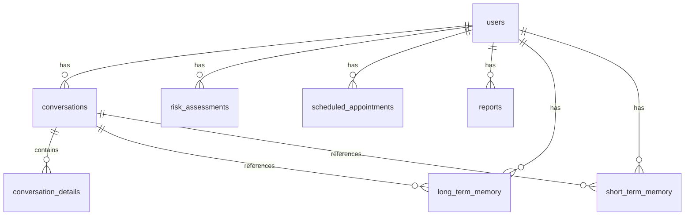

# EvelinaAI Database Schema Documentation

## Overview
The EvelinaAI database consists of multiple tables in the `evelinaai` schema, designed to support a medical AI companion system. This document reflects the current structure based on the Supabase database.

## Schema Information

- **Schema Name**: `evelinaai`
- **Database**: Supabase
- **Schema Version**: Current as of March 2024

## Tables

### 1. conversation_details
- `id`: UUID (Primary Key)
- `conversation_id`: UUID (Foreign Key → conversations.id)
- `message_content`: Text
- `message_type`: Text
- `sent_at`: Timestamp
- `sender`: Text
- `metadata`: JSONB

### 2. conversations
- `id`: UUID (Primary Key)  
- `user_id`: UUID (Foreign Key → users.id)
- `conversation_type`: Text
- `platform`: Text
- `status`: Text

### 3. long_term_memory
- `id`: UUID (Primary Key)
- `user_id`: UUID (Foreign Key → users.id)
- `conversation_id`: UUID (Foreign Key → conversations.id)
- `memory_type`: Text
- `content`: Text
- `recorded_at`: Timestamp

### 4. patients
- `id`: UUID (Primary Key)
- `name`: Text
- `email`: Text
- `phone`: Text
- `gender`: Text
- `preferred_language`: Text
- `created_at`: Timestamp
- `support_status`: Text

### 5. reports
- `id`: UUID (Primary Key)
- `generated_by`: UUID
- `report_type`: Text
- `generated_at`: Timestamp
- `report_format`: Text
- `storage_path`: Text

### 6. risk_assessments
- `id`: UUID (Primary Key)
- `user_id`: UUID (Foreign Key → users.id)
- `risk_type`: Text
- `risk_level`: Text ('low', 'medium', 'high')
- `trigger_criteria`: Text
- `detected_at`: Timestamp

### 7. scheduled_appointments
- `id`: UUID (Primary Key)
- `user_id`: UUID (Foreign Key → users.id)
- `scheduled_time`: Timestamp
- `contact_method`: Text
- `purpose`: Text
- `status`: Text

### 8. short_term_memory
- `id`: UUID (Primary Key)
- `user_id`: UUID (Foreign Key → users.id)
- `conversation_id`: UUID (Foreign Key → conversations.id)
- `content`: Text
- `expires_at`: Timestamp

## Relationships


## Supabase Client Configuration

When connecting to the database, the Supabase client should be configured to use the `evelinaai` schema:

```typescript
const supabase = createClient(supabaseUrl, supabaseKey, {
  auth: {
    persistSession: false,
    autoRefreshToken: false
  },
  global: {
    headers: {
      'apikey': supabaseKey,
      'Authorization': `Bearer ${supabaseKey}`,
      'Content-Type': 'application/json',
      'Accept-Profile': 'evelinaai'
    }
  }
});
```

## Key Features
1. User Management
   - Multi-role support (patient, doctor)
   - Activity tracking
   - Risk level monitoring

2. Medical Records
   - Risk assessments
   - Appointment scheduling
   - Report generation

3. AI Interaction
   - Conversation tracking
   - Memory management (short-term and long-term)
   - Detailed conversation analysis

## Security Considerations
- All tables include created_at timestamps for audit trails
- Foreign key constraints ensure data integrity
- JSONB fields allow flexible metadata storage while maintaining structure

## Performance Notes
- Indexes are recommended on:
  - users(email)
  - users(status)
  - conversations(user_id)
  - scheduled_appointments(scheduled_time)
  - risk_assessments(user_id, risk_level) 

## Schema Access Verification

To verify access to the schema, use the verification script:

```bash
node src/ai_companion/interfaces/web-ui/scripts/verify-evelinaai-schema.js
```

This script will test connectivity to all tables in the `evelinaai` schema and confirm schema existence. 