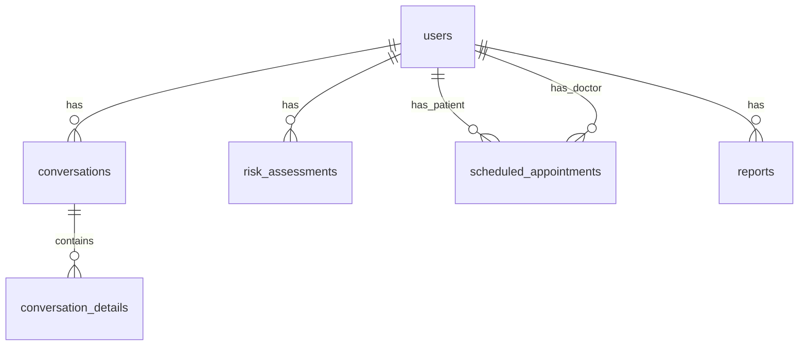

# EvelinaAI Database Schema Documentation

## Overview
The EvelinaAI database consists of 8 main tables in the `evelinaai` schema, designed to support a medical AI companion system.

## Tables

### 1. users (9 columns)
Primary table for storing user information
- `id`: UUID (Primary Key)
- `created_at`: Timestamp
- `email`: String
- `name`: String
- `status`: Enum ('active', 'inactive')
- `type`: Enum ('patient', 'doctor', 'admin')
- `last_active`: Timestamp
- `risk_level`: Enum ('low', 'medium', 'high')
- Additional metadata

### 2. conversations (7 columns)
Stores main conversation records
- `id`: UUID (Primary Key)
- `created_at`: Timestamp
- `user_id`: UUID (Foreign Key → users.id)
- `type`: String
- `details`: JSONB
- Additional metadata

### 3. conversation_details (7 columns)
Stores detailed conversation information
- `id`: UUID (Primary Key)
- `conversation_id`: UUID (Foreign Key → conversations.id)
- `created_at`: Timestamp
- `content`: Text
- Additional metadata

### 4. risk_assessments (7 columns)
Stores patient risk assessment data
- `id`: UUID (Primary Key)
- `created_at`: Timestamp
- `user_id`: UUID (Foreign Key → users.id)
- `risk_level`: Enum ('low', 'medium', 'high')
- `assessment_details`: JSONB
- Additional metadata

### 5. scheduled_appointments (6 columns)
Manages medical appointments
- `id`: UUID (Primary Key)
- `created_at`: Timestamp
- `user_id`: UUID (Foreign Key → users.id)
- `doctor_id`: UUID (Foreign Key → users.id)
- `appointment_date`: Timestamp
- `status`: Enum ('scheduled', 'completed', 'cancelled')

### 6. reports (7 columns)
Stores medical reports and analysis
- `id`: UUID (Primary Key)
- `created_at`: Timestamp
- `user_id`: UUID (Foreign Key → users.id)
- Additional metadata

### 7. long_term_memory (5 columns)
Stores persistent AI memory data
- `id`: UUID (Primary Key)
- `created_at`: Timestamp
- `content`: Text
- Additional metadata

### 8. short_term_memory (5 columns)
Stores temporary AI memory data
- `id`: UUID (Primary Key)
- `created_at`: Timestamp
- `content`: Text
- Additional metadata

## Relationships

## Key Features
1. User Management
   - Multi-role support (patient, doctor, admin)
   - Activity tracking
   - Risk level monitoring

2. Medical Records
   - Risk assessments
   - Appointment scheduling
   - Report generation

3. AI Interaction
   - Conversation tracking
   - Memory management (short-term and long-term)
   - Detailed conversation analysis

## Security Considerations
- All tables include created_at timestamps for audit trails
- Foreign key constraints ensure data integrity
- JSONB fields allow flexible metadata storage while maintaining structure
- Enum types enforce data validation for status and type fields

## Performance Notes
- Indexes are recommended on:
  - users(email)
  - users(status)
  - conversations(user_id)
  - scheduled_appointments(appointment_date)
  - risk_assessments(user_id, risk_level) 